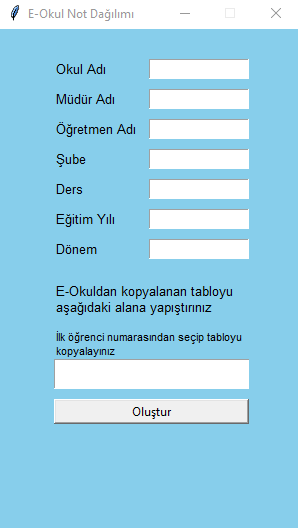

# EOkulNot

E-Okul not verisini girilen kriterlere göre dağıtma uygulaması

## Gerekenler

Python 3+

## Hazırlanış

Kodu sağ üstten Code tuşuna tıklayıp Download ZIP'e tıklayıp indirin ve istediğiniz bir konuma ayıklayın
Terminalden pip install -r requirements.txt ile gerekli kütüphaneleri kurun

## Kullanış

kod klasörü altında main.py dosyasını sağ tık Birlikte Aç -> Python ile kodu çalıştırınız
Açılan ekranda detayları giriniz  
Eokuldan Hzılı Ders Not girişi ekranında sol üstten öğrenci numarası dahil olacak şekilde tüm tabloyu seçip kopyalayınız  
Tabloyu ilgili alana yapıştırıp oluştur tuşuna basınız
Proje ve Ders Et.Ket dağılımları Excel dosya formatı olarak Masaüstünde oluşturulacaktır

## Uygulama Ekran Görüntüsü

